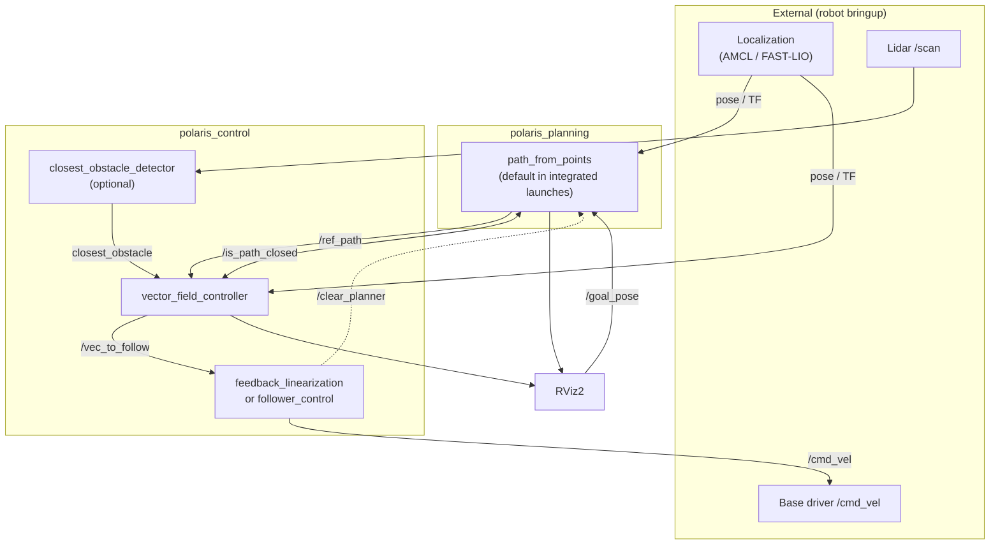

# Polaris Navigation

ROS 2 navigation stack for CORO lab robots (ITV / UFMG). The repository combines two packages:

| Package | Role |
|---|---|
| **[polaris_planning](polaris_planning/)** | Reference path generation (waypoints, files, parametric curves) |
| **[polaris_control](polaris_control/)** | Vector-field path tracking, optional obstacle avoidance, and low-level execution |

Together they form a lightweight alternative to Nav2: click goals in RViz, get a smooth path, follow it with a reactive controller, and convert the result to differential-drive commands.

---

## Documentation

| Document | Contents |
|---|---|
| **This file** | Repository overview and how planning + control integrate |
| [polaris_planning/docs/PATH_PLANNING.md](polaris_planning/docs/PATH_PLANNING.md) | Planner nodes, launches, topics, and config |
| [polaris_control/docs/NAVIGATION_AND_CONTROL.md](polaris_control/docs/NAVIGATION_AND_CONTROL.md) | Controller nodes, launches, FSM follower, obstacle avoidance |

---

## Architecture



### Responsibility split

| Layer | Package | Question it answers |
|---|---|---|
| **Planning** | `polaris_planning` | *Where should the robot go?* — builds `nav_msgs/Path` from waypoints or predefined curves |
| **High-level control** | `polaris_control` | *How fast and in what direction?* — vector field on the path, blended with obstacle avoidance when enabled |
| **Low-level control** | `polaris_control` | *What wheel commands?* — feedback linearization: global velocity vector → `Twist` |
| **Perception** | `polaris_control` | *What is blocking the path?* — DBSCAN on `LaserScan`, publishes closest obstacle point |

Planning and control communicate over a small, stable ROS interface (`ref_path`, services, optional `clear_planner`). The names are relative: standalone launches resolve them at the root, while multi-robot launches resolve them below `/<robot_namespace>`. Neither package depends on the other at build time; integration happens at launch time in `polaris_control`.

---

## How the packages integrate

### Shared contract

These topic and service names must stay aligned between packages (configured in YAML):

| Interface | Message / service | Producer | Consumer |
|---|---|---|---|
| Reference path | `nav_msgs/Path` on `/ref_path` | `path_from_points` | `vector_field_controller` |
| Path topology | `std_srvs/Trigger` on `/is_path_closed` | `path_from_points` | `vector_field_controller` |
| Velocity setpoint | `geometry_msgs/Vector3` on `/vec_to_follow` | `vector_field_controller` | `feedback_linearization` / `follower_control` |
| Wheel command | `geometry_msgs/Twist` on `/cmd_vel` | follower nodes | Robot base driver |
| Goal input | `geometry_msgs/PoseStamped` on `/goal_pose` | RViz | `path_from_points` |
| Path reset | `std_srvs/Trigger` on `/clear_planner` | — | `path_from_points` (called by `follower_control`) |

All paths and poses are expressed in the **`map`** frame by default.

### Integrated launches (recommended)

`polaris_control` launch files start **both** packages together:

```bash
# Build both packages
cd ~/polaris_ws
colcon build --symlink-install --packages-select polaris_planning polaris_control
source install/setup.bash

# Terminal 1 — planning + high-level control (+ optional perception)
ros2 launch polaris_control navigation.launch.py          # no obstacle avoidance
# or
ros2 launch polaris_control safe_nav_stack.launch.py      # with closest_obstacle_detector

# Terminal 2 — low-level execution
ros2 launch polaris_control feedback_linearization.launch.py   # simple follower
# or
ros2 launch polaris_control follower_control.launch.py         # FSM: stop / align yaw
```

What each integrated launch starts:

| Launch | polaris_planning | polaris_control |
|---|---|---|
| `navigation.launch.py` | `path_from_points` + `path_from_points.yaml` | `vector_field_controller`, RViz, static TFs |
| `safe_nav_stack.launch.py` | same | + `closest_obstacle_detector` |

External nodes (localization, lidar, base driver) are **not** included and must run separately.

### Standalone planner

To run only the planner (e.g. for debugging path generation):

```bash
ros2 launch polaris_planning launch_planner.xml
```

Edit `launch_planner.xml` to select `path_from_points`, `path_from_file`, or `path_from_equation`. Pair this with `polaris_control` nodes launched individually when testing components in isolation.

---

## End-to-end workflow

1. **Localization** publishes robot pose (`/amcl_pose` or TF `map` → `body`).
2. **Operator** clicks a goal in RViz (`/goal_pose`).
3. **Planner** interpolates waypoints, publishes `/ref_path`, and exposes `/is_path_closed`.
4. **Vector-field controller** reads path + pose (+ optional obstacle), publishes `/vec_to_follow`.
5. **Follower** converts `/vec_to_follow` to `/cmd_vel` for the base driver.
6. On open paths, the controller slows near the goal and stops inside `goal_tolerance`.

Optional FSM flow with `follower_control`:

- `/stop_robot` → halt and call `/clear_planner`
- `/stop_control` (`std_msgs/String`) → explicitly select `CONTROL_POSITION` or
  `ALIGN_YAW` at `/inspection_pose`; commands are idempotent and transient-local
- `FollowerControlState` from `petro_rmf_utils` is the canonical definition of
  `STOPPED`, `CONTROL_POSITION`, and `ALIGN_YAW`

---

## Launch matrix

| Mission profile | High-level launch | Low-level launch | Planner node |
|---|---|---|---|
| Indoor, no reactive avoidance | `navigation.launch.py` | `feedback_linearization.launch.py` | `path_from_points` (bundled) |
| Field robot with lidar | `safe_nav_stack.launch.py` | `feedback_linearization.launch.py` | `path_from_points` (bundled) |
| Inspection (pause + align) | `safe_nav_stack.launch.py` | `follower_control.launch.py` | `path_from_points` (bundled) |
| Replay saved path | `navigation.launch.py` + swap planner to `path_from_file` | `feedback_linearization.launch.py` | `path_from_file` |
| Demo / bench curve | `demo.launch.py` | `feedback_linearization.launch.py` | `path_from_equation` |

See package docs for parameter files and topic remapping details.

---

## Repository layout

```
polaris_navigation/
├── README.md                          ← this file
├── CHANGELOG.md
├── polaris_planning/                  ← path generation
│   ├── docs/PATH_PLANNING.md
│   ├── src/                           ← path_from_points, path_from_file, path_from_equation
│   ├── config/
│   ├── launch/
│   └── path_txt/                      ← sample paths for path_from_file
└── polaris_control/                   ← control + perception + execution
    ├── docs/NAVIGATION_AND_CONTROL.md
    ├── src/                           ← vector_field_control, closest_obstacle_detector, followers
    ├── config/
    └── launch/                        ← integrated stacks (planning + control)
```

---

## Build prerequisites

- ROS 2 (Jazzy or compatible distribution)
- `colcon`, `rosdep`
- Eigen3 (used by `polaris_planning` and obstacle detector)

```bash
cd ~/polaris_ws
rosdep install -i --from-paths src/polaris_navigation --rosdistro $ROS_DISTRO -y
colcon build --symlink-install
source install/setup.bash
```

---

## References

- Obstacle avoidance: Nunes et al. (2022), *Vector field for curve tracking with obstacle avoidance* — [IEEE](https://ieeexplore.ieee.org/document/9992435)
- [CHANGELOG.md](CHANGELOG.md) — release history for both packages
