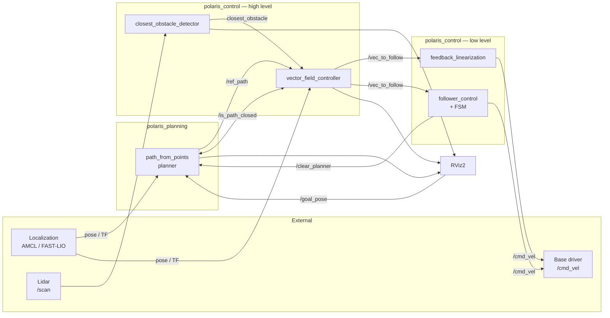

# Polaris Control — Navigation & Control Stack

This document describes how to run the **polaris_control** navigation stack, how its nodes integrate with **polaris_planning** and the rest of the robot software, and what the main source files do.

For the repository-level integration overview, see [polaris_navigation README.md](../../README.md). For planner-specific details, see [polaris_planning/docs/PATH_PLANNING.md](../../polaris_planning/docs/PATH_PLANNING.md).

The stack is split into two layers:

1. **High-level navigation** — path planning + vector-field control (optionally with obstacle avoidance).
2. **Low-level execution** — converts a desired velocity vector into differential-drive `cmd_vel`, with or without an orientation FSM.

---

## Quick reference — launch files

| Launch file | Role | Obstacle avoidance | Orientation FSM |
|---|---|---|---|
| [`navigation.launch.py`](../launch/navigation.launch.py) | Full nav stack (planner + controller + RViz + TF) | **No** (detector not started) | N/A |
| [`safe_nav_stack.launch.py`](../launch/safe_nav_stack.launch.py) | Full nav stack + perception | **Yes** (`closest_obstacle_detector`) | N/A |
| [`feedback_linearization.launch.py`](../launch/feedback_linearization.launch.py) | Low-level follower only | N/A | **No** |
| [`follower_control.launch.py`](../launch/follower_control.launch.py) | Low-level follower only | N/A | **Yes** |

Other launches (legacy / demo):

| Launch file | Notes |
|---|---|
| [`demo.launch.py`](../launch/demo.launch.py) | Older demo stack; uses `path_from_equation` and Scout-specific static TFs |

## Namespaced robot stacks

`navigation.launch.py` and `follower_control.launch.py` accept the same
multi-robot arguments:

- `robot_namespace` places every launched node and relative ROS interface under
  the robot name.
- `namespace_tf:=true` remaps `/tf` and `/tf_static` to the robot's namespaced
  TF topics. It requires a non-empty `robot_namespace`.
- `use_sim_time` selects the simulation clock for all nodes in the launch.

Launch both halves of a simulated Pioneer stack as follows:

```bash
ros2 launch polaris_control navigation.launch.py \
  robot_namespace:=pioneer_1 namespace_tf:=true use_sim_time:=true
ros2 launch polaris_control follower_control.launch.py \
  robot_namespace:=pioneer_1 namespace_tf:=true use_sim_time:=true
```

The resulting nodes are `/pioneer_1/controller`, `/pioneer_1/planner`, and
`/pioneer_1/follower_control`. Robot-local topics and services are relative in
the parameter YAML, so names such as `tf`, `goal_pose`, `ref_path`,
`vec_to_follow`, and `cmd_vel` resolve below `/pioneer_1`. Omitting the
namespace arguments preserves the standalone root-namespace behavior.

---

## How to run (dummy workflow)

These commands assume a ROS 2 workspace with **polaris_control** and **polaris_planning** built, and the robot stack (localization, lidar, base driver) running separately.

### 1. Build and source

```bash
cd ~/polaris_ws
colcon build --symlink-install --packages-select polaris_control polaris_planning
source install/setup.bash
```

### 2. Start localization and sensors (external — not in this package)

Run your robot bringup as usual. The control stack expects at least:

- Robot pose in **`map`** (e.g. `/amcl_pose` as `PoseWithCovarianceStamped`, or TF `map` → `body`)
- Lidar publishing **`/scan`** (only required for `safe_nav_stack.launch.py`)
- Base driver subscribed to **`/cmd_vel`**

```bash
# Example placeholders — replace with your robot launch files
ros2 launch <your_robot_pkg> localization.launch.py
ros2 launch <your_robot_pkg> lidar.launch.py
ros2 launch <your_robot_pkg> base_driver.launch.py
```

### 3. Start high-level navigation

**Without obstacle avoidance:**

```bash
ros2 launch polaris_control navigation.launch.py
```

**With obstacle avoidance:**

```bash
ros2 launch polaris_control safe_nav_stack.launch.py
```

### 4. Start low-level control (second terminal)

**Without orientation FSM** (always tracks the vector field when a path is active):

```bash
ros2 launch polaris_control feedback_linearization.launch.py
```

**With orientation FSM** (supports stop, path clear, and yaw alignment at inspection points):

```bash
ros2 launch polaris_control follower_control.launch.py
```

### 5. Send goals in RViz

With RViz open (started by the nav launches):

1. Use **Publish Point** / **2D Goal Pose** on topic **`/goal_pose`** to add waypoints.
2. Call **`/start_planner`** when ready to begin publishing the interpolated path.
3. Optional: **`/close_path`** for a closed loop, **`/clear_planner`** to reset, **`/remove_last_point`** to undo the last waypoint.

```bash
# Dummy service calls
ros2 service call /start_planner std_srvs/srv/Trigger {}
ros2 service call /clear_planner std_srvs/srv/Trigger {}
```

### 6. FSM-specific commands (follower_control only)

When using `follower_control.launch.py`:

```bash
# Stop motion and clear the path (from CONTROL_POSITION)
ros2 topic pub --once /stop_robot std_msgs/msg/Bool "{data: true}"

# Select yaw alignment (clears the path only when entering ALIGN_YAW)
ros2 topic pub --once --qos-reliability reliable --qos-durability transient_local \
  /stop_control std_msgs/msg/String "{data: ALIGN_YAW}"

# Select path tracking. Repeating either state command is harmless.
ros2 topic pub --once --qos-reliability reliable --qos-durability transient_local \
  /stop_control std_msgs/msg/String "{data: CONTROL_POSITION}"

# Target point to face while in ALIGN_YAW (default topic: /inspection_pose)
ros2 topic pub --once --qos-reliability reliable --qos-durability transient_local \
  /inspection_pose geometry_msgs/msg/PoseStamped \
  "{header: {frame_id: 'map'}, pose: {position: {x: 1.0, y: 2.0, z: 0.0}}}"
```

---

## Architecture — how components integrate



### Data flow summary

| Stage | Input | Output | Node |
|---|---|---|---|
| Planning | Clicked points (`/goal_pose`), robot pose | Interpolated path (`/ref_path`) | `path_from_points` |
| Vector field | Path, pose, optional closest obstacle | Desired velocity vector (`/vec_to_follow`) | `vector_field_controller` |
| Perception | `sensor_msgs/LaserScan` | Closest obstacle point (`closest_obstacle`) | `closest_obstacle_detector` |
| Execution | `/vec_to_follow`, robot orientation | `geometry_msgs/Twist` on `/cmd_vel` | `feedback_linearization` or `follower_control` |

All spatial quantities are handled in the **`map`** frame (configured via `tf_reference_frame` / `world_frame` in the YAML params).

### navigation.launch.py vs safe_nav_stack.launch.py

Both launches start the same core nodes:

- **RViz2** with [`config/demo_rviz.rviz`](../config/demo_rviz.rviz)
- **`vector_field_controller`** — path following via vector fields
- **`path_from_points`** (from **polaris_planning**)
- Static TFs: `map` → `odom`, `body` → `livox_frame`

The difference is obstacle handling:

| | `navigation.launch.py` | `safe_nav_stack.launch.py` |
|---|---|---|
| `closest_obstacle_detector` | Not launched | Launched |
| Params file | `pioneer_params.yaml` | `scout_params.yaml` |
| Effective avoidance | Disabled (no obstacle messages received) | Enabled when lidar + TF are available |

Even though both param files set `flag_follow_obstacle: true`, the controller only blends avoidance fields when it receives obstacle data on `closest_obstacle`. Without the detector node, behavior reduces to pure path following.

To disable avoidance explicitly while running the safe stack, set `flag_follow_obstacle: false` under the `controller` section in the params YAML.

### feedback_linearization vs follower_control

Both nodes subscribe to **`/vec_to_follow`** (`geometry_msgs/Vector3`) from the vector-field controller and publish **`/cmd_vel`** (`geometry_msgs/Twist`) using the same feedback-linearization law: rotate the global desired velocity into the robot frame and map it to linear `v` and angular `ω` using a control-point distance `distancia_ponto_controle`.

| | `feedback_linearization.py` | `follower_control.py` |
|---|---|---|
| FSM | None — always active when vector is present | `STOPPED` → `CONTROL_POSITION` → `ALIGN_YAW` |
| Stop / clear path | No | `/stop_robot`, `/stop_control` |
| Yaw alignment | No | `/inspection_pose` (param: `orient_point_topic`) |
| Planner interaction | No | Calls `/clear_planner` on stop transitions |

Use **feedback_linearization** for simple go-to-path behavior. Use **follower_control** when the mission requires pausing, clearing the path, or rotating in place to face inspection targets.

---

## Main files

### Launch files

| File | Description |
|---|---|
| [`launch/navigation.launch.py`](../launch/navigation.launch.py) | Minimal navigation stack: RViz, planner, vector-field controller, static TFs. No lidar perception. |
| [`launch/safe_nav_stack.launch.py`](../launch/safe_nav_stack.launch.py) | Same as above plus `closest_obstacle_detector` for reactive avoidance. |
| [`launch/feedback_linearization.launch.py`](../launch/feedback_linearization.launch.py) | Starts only the feedback-linearization follower node. |
| [`launch/follower_control.launch.py`](../launch/follower_control.launch.py) | Starts only the FSM-based follower node. |
| [`launch/demo.launch.py`](../launch/demo.launch.py) | Legacy demo with equation-based planner and Scout/FAST-LIO TFs. |

### C++ nodes (built via `CMakeLists.txt`)

| File | Executable | Role |
|---|---|---|
| [`src/vector_field_control.cpp`](../src/vector_field_control.cpp) | `vector_field_controller` | Core controller. Tracks `ref_path` with a vector field; optionally blends an obstacle-circumnavigation field ([Nunes et al., 2022](https://ieeexplore.ieee.org/document/9992435)). Publishes `/vec_to_follow`, visualizes command and path in RViz. Runs at 20 Hz. |
| [`src/closest_obstacle_detector.cpp`](../src/closest_obstacle_detector.cpp) | `closest_obstacle_detector` | Subscribes to `LaserScan`, clusters returns with DBSCAN, transforms to `map`, publishes the closest cluster centroid as `geometry_msgs/Point`. |

### Python nodes

| File | Role |
|---|---|
| [`src/feedback_linearization.py`](../src/feedback_linearization.py) | Converts `/vec_to_follow` → `/cmd_vel` without state machine. |
| [`src/follower_control.py`](../src/follower_control.py) | Same conversion plus FSM for stop, path clear, and yaw alignment. |
| [`scripts/robot_simulator.py`](../scripts/robot_simulator.py) | Standalone simulator (TF + markers + fake obstacle) for offline testing. Not started by the main nav launches (commented out). |

### Configuration

| File | Used by | Purpose |
|---|---|---|
| [`config/pioneer_params.yaml`](../config/pioneer_params.yaml) | `navigation.launch.py`, `feedback_linearization.launch.py`, `follower_control.launch.py` | Params for `controller`, `feedback_linearization`, and `follower_control` nodes (Pioneer robot / generic setup). |
| [`config/scout_params.yaml`](../config/scout_params.yaml) | `safe_nav_stack.launch.py` | Same structure as pioneer params; used with Scout platform. |
| [`config/closest_obstacle_detector_params.yaml`](../config/closest_obstacle_detector_params.yaml) | `safe_nav_stack.launch.py` | Lidar topic, DBSCAN settings, frames (`livox_frame` → `map`). |
| [`config/demo_rviz.rviz`](../config/demo_rviz.rviz) | Nav launches | Preconfigured RViz layout (path, markers, TF). |
| [`config/follow_params.yaml`](../config/follow_params.yaml) | Legacy wall-following (TODO) | Parameters for unimplemented `follow_wall` node. |
| [`config/control_params.yaml`](../config/control_params.yaml) | Legacy | Old espeleo_control parameter format; superseded by `pioneer_params.yaml` / `scout_params.yaml`. |

Param files use ROS 2 node namespaces (`controller:`, `feedback_linearization:`, `follower_control:`) that must match the node `name=` in each launch file.

### Build / package metadata

| File | Role |
|---|---|
| [`CMakeLists.txt`](../CMakeLists.txt) | Builds C++ executables; installs launches, config, URDF, Python scripts. |
| [`package.xml`](../package.xml) | ROS 2 package manifest and dependencies. |
| [`setup.py`](../setup.py) | Legacy setuptools stub (main build is ament_cmake). |

### TODO / reference implementations

| Path | Status |
|---|---|
| [`src/TODO/`](../src/TODO/) | Reference code for future nodes: `follow_wall`, `follow_corridor`, alternate obstacle detector, C++ feedback linearization. Not built or installed. |

---

## Key topics and services

### Topics

| Topic | Type | Publisher | Subscriber(s) |
|---|---|---|---|
| `/goal_pose` | `PoseStamped` | RViz | `path_from_points` |
| `/ref_path` | `Path` | `path_from_points` | `vector_field_controller` |
| `/vec_to_follow` | `Vector3` | `vector_field_controller` | `feedback_linearization`, `follower_control` |
| `/cmd_vel` | `Twist` | follower nodes | Robot base driver |
| `/amcl_pose` | `PoseWithCovarianceStamped` | Localization | Controller + followers (configurable) |
| `closest_obstacle` | `Point` | `closest_obstacle_detector` | `vector_field_controller` |
| `/scan` | `LaserScan` | Lidar driver | `closest_obstacle_detector` |
| `/visualization_command` | `Marker` | `vector_field_controller` | RViz |
| `/visualization_path` | `MarkerArray` | `vector_field_controller` | RViz |
| `/obstacle_clusters` | `MarkerArray` | `closest_obstacle_detector` | RViz |
| `/inspection_pose` | `PoseStamped` | External / mission node | `follower_control` |
| `/stop_robot` | `Bool` | External | `follower_control` |
| `/stop_control` | `String` | External | `follower_control` |

`/stop_control` is a RELIABLE + TRANSIENT_LOCAL desired-state command, not a
toggle event. The only accepted values are `ALIGN_YAW` and `CONTROL_POSITION`.
Publishers must use the same message type and durability. This makes duplicate
delivery, late-joiner replay, and rapid command replacement idempotent.
The follower imports the canonical `FollowerControlState` enum from
`petro_rmf_utils`; `STOPPED` remains an internal FSM state selected through
`/stop_robot`, not a valid `/stop_control` command.

### Services (polaris_planning)

| Service | Type | Purpose |
|---|---|---|
| `/start_planner` | `Trigger` | Begin publishing the interpolated path |
| `/clear_planner` | `Trigger` | Clear waypoints and path |
| `/close_path` | `Trigger` | Close the path loop |
| `/is_path_closed` | `Trigger` | Queried by controller to know if goal-stop logic applies |
| `/remove_last_point` | `Trigger` | Remove the last added waypoint |

---

## TF frames

The launches publish static transforms expected by the rest of the stack:

| Transform | Purpose |
|---|---|
| `map` → `odom` | Identity (assumes localization publishes `odom` → `body`) |
| `body` → `livox_frame` | Lidar mount offset (0.32 m on Z) |

Configure `tf_robot_pose`, `tf_reference_frame`, and detector `world_frame` / `laser_frame` in the YAML files to match your robot URDF and localization frames.

---

## Typical deployment combinations

| Scenario | High-level launch | Low-level launch |
|---|---|---|
| Indoor mapping, no reactive avoidance | `navigation.launch.py` | `feedback_linearization.launch.py` |
| Field robot with lidar | `safe_nav_stack.launch.py` | `feedback_linearization.launch.py` |
| Inspection mission (pause + align) | `safe_nav_stack.launch.py` | `follower_control.launch.py` |
| Simulation / bench test | `navigation.launch.py` + uncomment `robot_simulator` in launch file | `feedback_linearization.launch.py` |

---

## Related packages

- **[polaris_planning](../../polaris_planning/)** — waypoint-based path planner (`path_from_points`). Required by both nav launches.
- **Robot bringup** — localization, lidar, and base driver are outside this package and must be running before starting control.

---

## References

- Vector-field obstacle avoidance: Nunes, A. H. D., et al. (2022). *Vector field for curve tracking with obstacle avoidance*. IEEE. [DOI link](https://ieeexplore.ieee.org/document/9992435)
- Package README: [`README.md`](../README.md)
